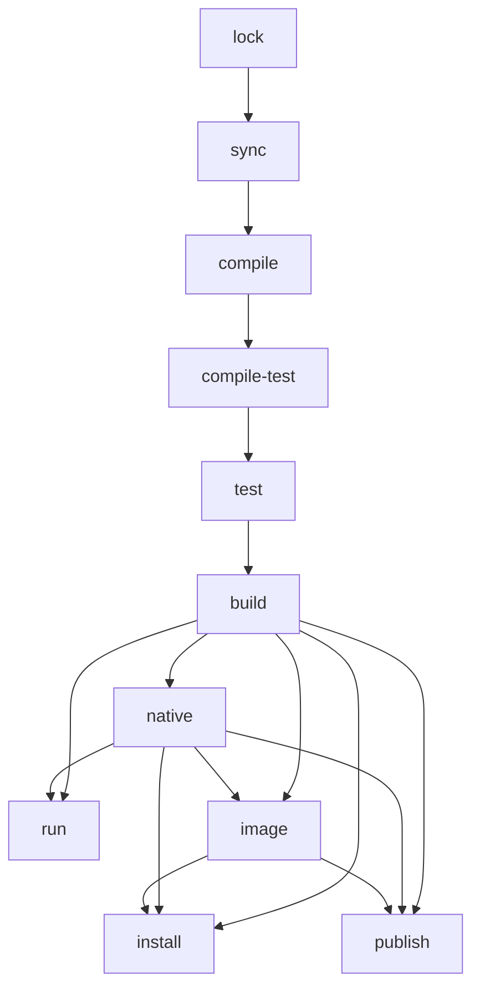

# Build Pipeline Diagram

```mermaid
flowchart TD
    lock --> sync
    sync --> compile
    compile --> compile-test
    compile-test --> test
    test --> build
    
    %% Native compilation
    build --> native

    %% Run and Image dependencies (depend on build OR native)
    build --> run
    native --> run
    build --> image
    native --> image

    %% Install and Publish dependencies (depend on build OR native OR image)
    build --> install
    native --> install
    image --> install

    build --> publish
    native --> publish
    image --> publish
```